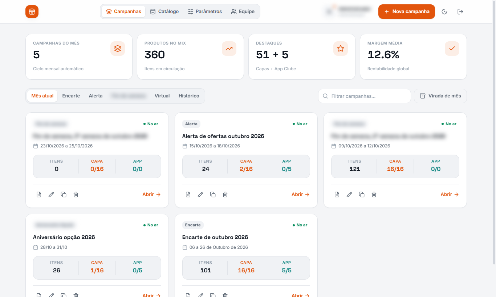
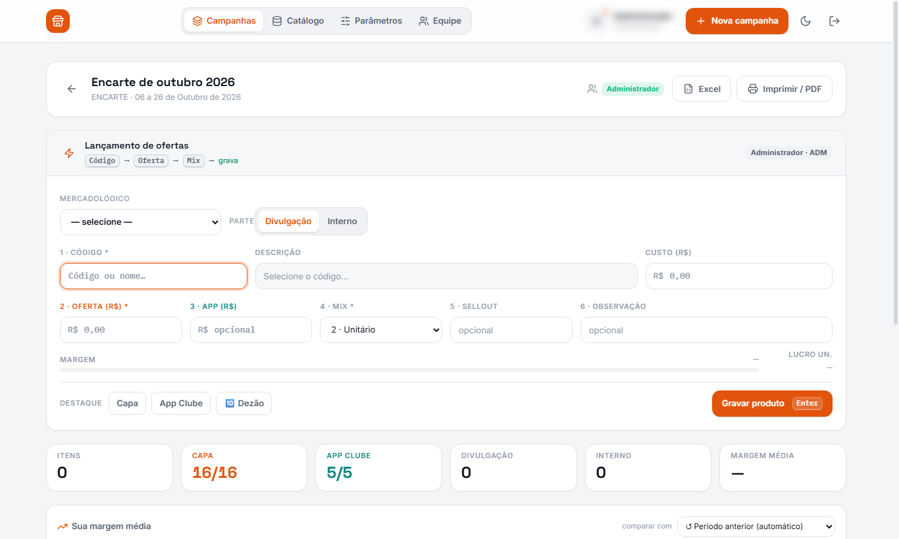
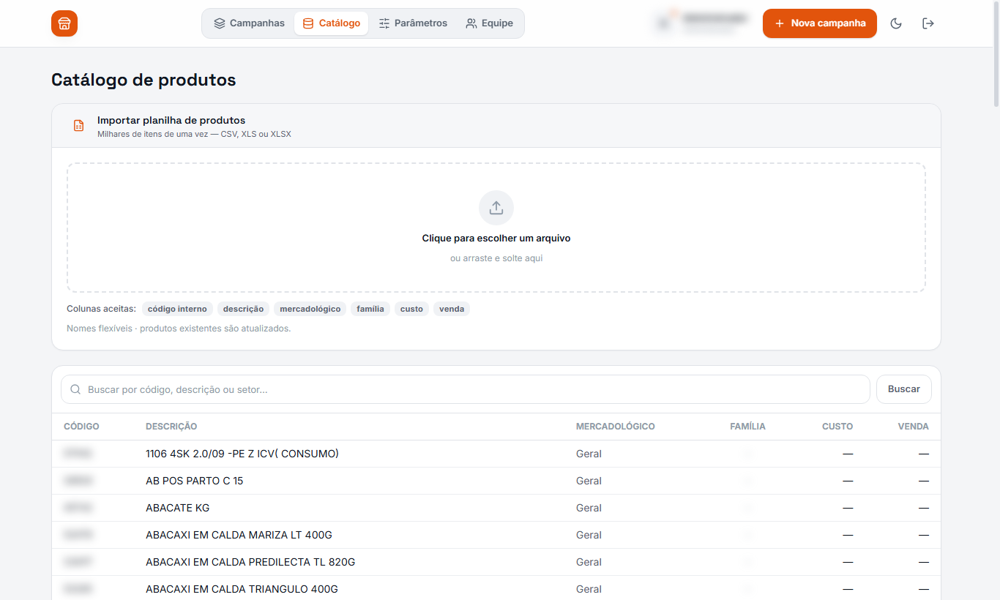
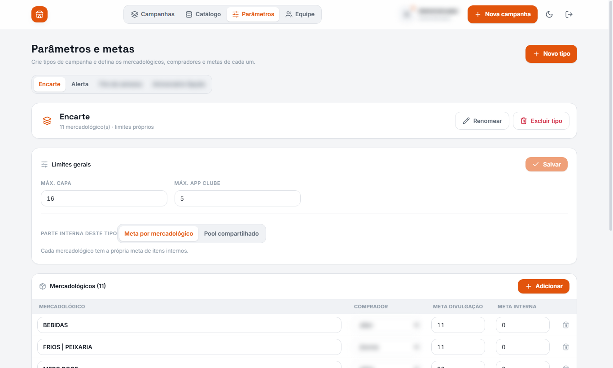
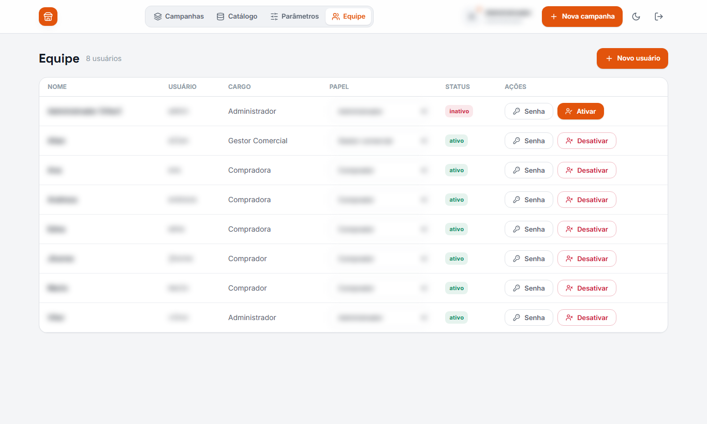

# Sistema de Mix de Ofertas & Encartes (v4.5)

Solução full-stack e plataforma analítica para planejamento, governança e gestão colaborativa de ofertas e mix promocional em redes de supermercados. A arquitetura combina uma interface reativa em **React + Tailwind CSS (Vite)**, back-end em tempo real de alta performance em **FastAPI + Socket.IO**, persistência relacional em **MySQL**, pipeline de dados em **Python (Pandas)** e módulo de automação corporativa em **Google Apps Script**.

> **Nota de Privacidade e Anonimização (LGPD):** Todas as capturas de tela desta documentação foram obtidas a partir de sessão autenticada com privilégios de Administrador (`ADMIN`). Informações sensíveis de identificação corporativa, marcas, nomes reais de compradores, credenciais de acesso e logins de operadores foram rigorosamente ofuscados por filtros visuais de privacidade (*blur* dinâmico). Os dados exibidos nas métricas e tabelas são de caráter demonstrativo.

---

## Telas do Sistema (Visão Completa do Administrador)

A aplicação conta com navegação segmentada em 5 abas principais, oferecendo controle total desde a governança estratégica de cotas até o lançamento operacional dos tabloides:

### 1. Campanhas & Encartes
Painel executivo com visão panorâmica do ciclo promocional do mês. Agrupa os encartes ativos, alertas de ofertas e ações sazonais de fim de semana. Disponibiliza cards analíticos em tempo real com o total de itens no mix, ocupação de cotas de destaque (Capa e App Clube) e margem média global ponderada.


* **Recursos principais:** Criação de novas campanhas, filtros por tipo (Encarte, Alerta, Fim de Semana, Virtual), duplicação rápida para o próximo ciclo e exportação direta para planilha.

---

### 2. Editor de Mix & Lançamento de Ofertas
Ambiente operacional onde o time comercial e compradores montam as ofertas dos tabloides item a item. Permite vincular produtos aos departamentos mercadológicos, definir tipo de divulgação (externa ou interna de loja), aplicar tags de destaque (Capa, App Clube ou Dezão) e calcular margens e lucros unitários em tempo real.


* **Recursos principais:** Validação instantânea de margem com travas de rentabilidade, controle dinâmico de cotas preenchidas vs. autorizadas, histórico comparativo com períodos anteriores e geração de relatórios oficiais para impressão (PDF) e conferência (Excel).

---

### 3. Catálogo Geral de Produtos
Repositório centralizado de mercadorias da rede para busca instantânea e abastecimento do mix promocional. Oferece importação em lote com detecção automática de colunas para milhares de itens em formato CSV ou XLSX.


* **Recursos principais:** Consulta unificada por código de barras ou descrição, visualização de custos cadastrais, preços de venda, famílias de produtos e sincronização automatizada com sistemas legados de ERP.

---

### 4. Parâmetros & Configuração de Cotas por Departamento
Módulo de governança onde a diretoria comercial estabelece os parâmetros e limites de cada tipo de campanha. Configura cotas de itens para cada mercadológico (Bebidas, Carnes/Frios, Mercearia, Hortifrúti, etc.), atribui o comprador responsável por cada setor e define regras de *pool* compartilhado.


* **Recursos principais:** Configuração de limites máximos de capa de tabloide e aplicativo de fidelidade, atribuição de mercadológicos a compradores, definição de metas de divulgação impressa vs. interna de loja.

---

### 5. Gestão de Equipe & Usuários Comerciais
Painel administrativo de controle de acesso baseado em papéis (RBAC). Permite gerenciar contas de usuários, delegar cargos (Administrador, Gestor Comercial, Comprador), redefinir senhas de acesso e realizar ativação/desativação imediata de credenciais de colaboradores.


* **Recursos principais:** Cadastro e edição de perfis de operadores, controle de status de acesso (ativo/inativo), auditoria de papéis operacionais e notificações em tempo real.

---

## Arquitetura Técnica

```text
  [ Front-end React / Vite ]  <--- WebSocket / REST --->  [ Back-end FastAPI + Socket.IO ]
              │                                                             │
    Perfis de Compradores                                          Regras de Margem e Cotas
    Catálogo & Encartes                                                     │
                                                                   [ Banco de Dados MySQL ]
                                                                            │
  [ Pipeline Pandas (ETL) ]   <--- Exportação de Dados <────────────────────┘
              │
  [ Google Apps Script / Sheets ]
```

* **Front-end (`src/`):** React 18, Tailwind CSS, Lucide Icons e Vite.
* **Back-end em Tempo Real (`main.py`):** API FastAPI assíncrona com servidor Socket.IO para sincronização instantânea de colaboração e bloqueio de concorrência.
* **Persistência Relacional (`ofertas_mysql.py`):** Modelagem estruturada em MySQL com integridade referencial, histórico de ofertas e auditoria de ações.
* **Exportação Analítica (`excel_export.py`):** Geração dinâmica de planilhas operacionais com formatação condicional via OpenPyXL.
* **Pipeline em Lote (`pipeline_ofertas.py`):** Tratamento, propagação de informações e cálculo de métricas em lote via Pandas.
* **Integração Cloud (`mix_ofertas.gs`):** Script em Google Apps Script para comunicação com planilhas corporativas no Google Workspace.
* **Distribuição Desktop:** Suporte a empacotamento com WebView2 (`app_desktop_v2.py`) e instalador executável via Inno Setup (`installer_v2.iss`).

---

## Como Executar

### 1. Plataforma Web / Desktop
```bash
# Instalar dependências Python
pip install fastapi uvicorn socketio python-socketio bcrypt openpyxl pymysql mysql-connector-python

# Instalar pacotes do front-end e gerar o build
npm install
npm run build

# Iniciar o servidor
python main.py
```
Acesse `http://localhost:3001` no navegador (ou execute o aplicativo empacotado).

### 2. Pipeline de Dados em Lote (ETL)
```bash
python pipeline_ofertas.py
```

---

## Stack Tecnológica
`React 18` · `Tailwind CSS` · `Vite` · `FastAPI` · `Socket.IO` · `Python 3.12` · `MySQL` · `Pandas` · `Google Apps Script` · `PyInstaller`

---

## Autor
**Vitor Santos** — Análise de Dados e Inteligência Comercial (Varejo & Supply Chain)
