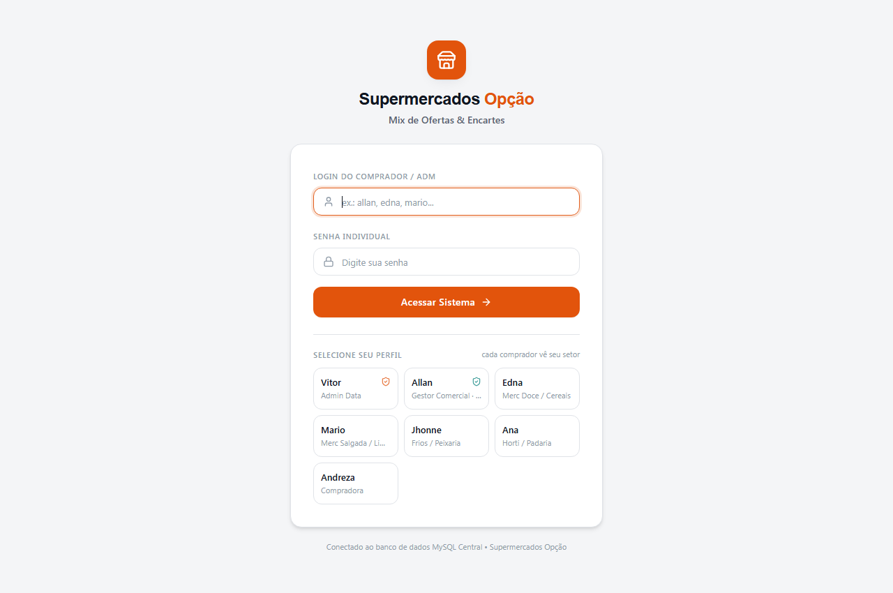

# Sistema de Mix de Ofertas & Encartes (v2.0)

Solução full-stack e pipeline de dados para gestão colaborativa de ofertas e mix de produtos em rede de supermercados. Combina uma plataforma moderna com front-end reativo em **React + Tailwind CSS (Vite)**, back-end em tempo real **FastAPI + Socket.IO**, persistência em **MySQL**, além do pipeline de dados analítico em **Python (Pandas)** e módulo de integração em **Google Apps Script**.

<div align="center">
  
</div>

> **Nota de confidencialidade:** todos os dados e cadastros presentes neste repositório são fictícios, gerados apenas para demonstração da arquitetura e das interfaces. Os dados reais da operação em que a solução foi implementada são confidenciais e estão protegidos.

---

## Visão Geral

A definição das ofertas e tabloides em um supermercado envolve múltiplos compradores, centenas de SKUs, margens rigorosas e cotas de espaço em encartes. O sistema atua em duas frentes complementares:

1. **Plataforma Colaborativa v2.0 (SPA + API):** Permite que os compradores gerenciem seus itens por departamento (Mercearia, Carnes/Frios, Hortifrúti, etc.), controlem cotas por campanha e salvem suas seleções de forma integrada e segura.
2. **Pipeline de Dados & Automação:** Rotinas em Pandas para limpeza, propagação de informações (*forward-fill*) e cálculo automático de margens, integradas ao ecossistema de planilhas via Apps Script.

---

## Arquitetura e Componentes

```text
  [ Front-end React / Vite ]  <--- WebSocket / HTTP --->  [ Back-end FastAPI + Socket.IO ]
             |                                                              |
   Perfis de Compradores                                           Regras de Margem e Cotas
   Catálogo & Encartes                                                      |
                                                                   [ Banco de Dados MySQL ]
                                                                            |
  [ Pipeline Pandas (ETL) ]   <--- Exportação de Dados <--------------------+
             |
  [ Google Apps Script / Sheets ]
```

- **Front-end (`src/`):** Interface moderna construída com React 18, Tailwind CSS, Lucide Icons e Vite.
- **Servidor em Tempo Real (`main.py`):** API FastAPI com Socket.IO para sincronização instantânea de cotas e eventos entre diferentes compradores.
- **Camada de Banco de Dados (`ofertas_mysql.py`):** Gerenciamento e persistência relacional com MySQL.
- **Exportação de Relatórios (`excel_export.py`):** Geração dinâmica de planilhas operacionais com OpenPyXL.
- **Pipeline em Lote (`pipeline_ofertas.py`):** Limpeza, tratamento e cálculo de margem histórica via Pandas.
- **Módulo de Integração (`mix_ofertas.gs`):** Automação corporativa para padronização no Google Sheets.
- **Distribuição Desktop:** Suporte a empacotamento com WebView2 (`app_desktop_v2.py`) e instalador Inno Setup (`installer_v2.iss`).

---

## Como Rodar

### 1. Plataforma Web / Desktop (v2.0)
```bash
# Dependências Python
pip install fastapi uvicorn socketio python-socketio bcrypt openpyxl pymysql

# Instalar pacotes do front-end e gerar build estático
npm install
npm run build

# Iniciar o servidor
python main.py
```
Acesse `http://localhost:3001` no navegador.

### 2. Pipeline em Lote (ETL)
```bash
pip install pandas
python pipeline_ofertas.py
```

---

## Stack Tecnológica
`React 18` · `Vite` · `Tailwind CSS` · `FastAPI` · `Python` · `Socket.IO` · `MySQL` · `Pandas` · `Google Apps Script`

---

## Autor
**José Vitor Santos Pinheiro** — Análise de Dados e Inteligência Comercial (Varejo e Supply Chain)  
Contato: vytorsantt@gmail.com
